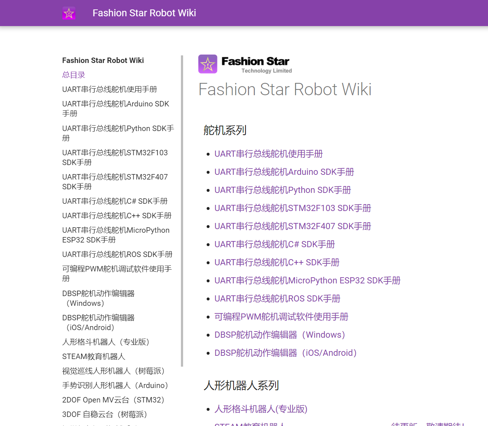
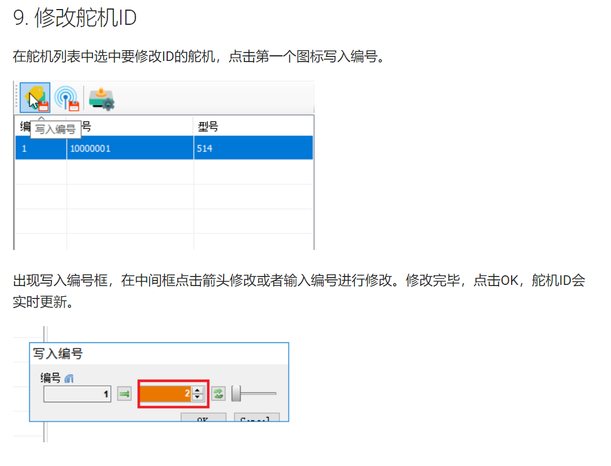
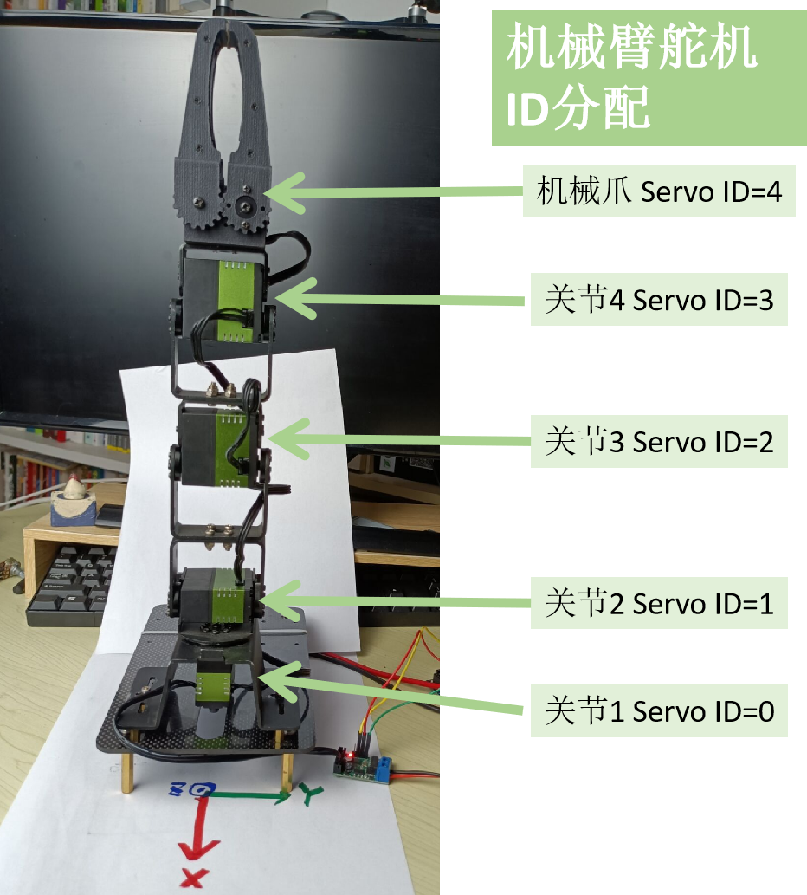
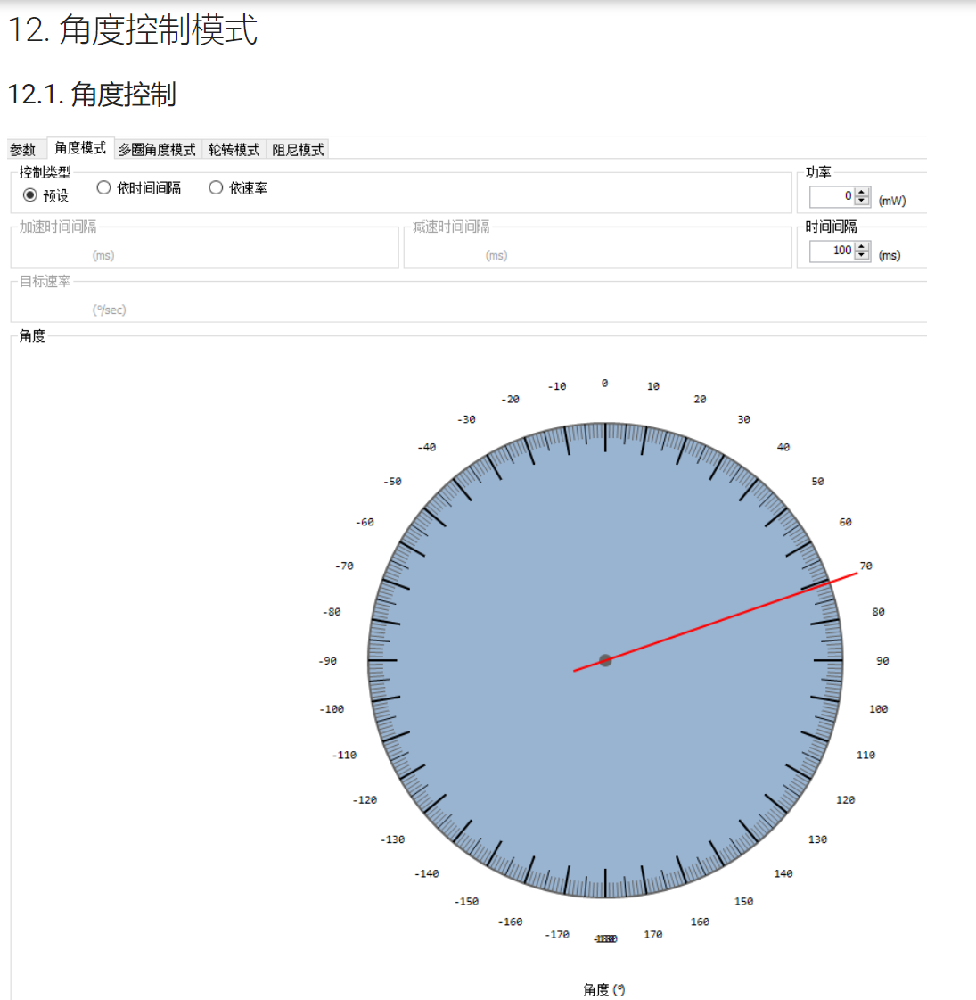
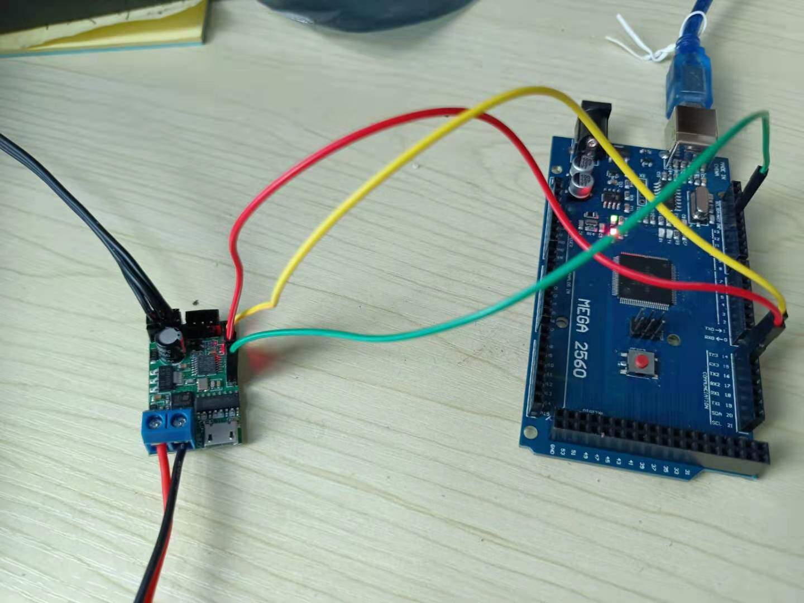
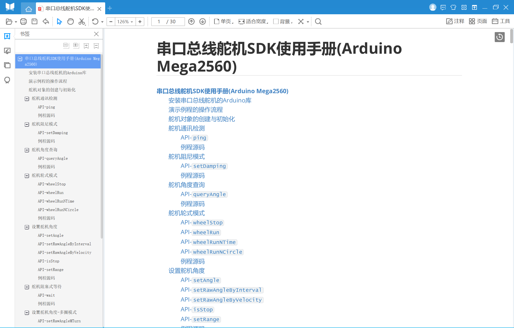
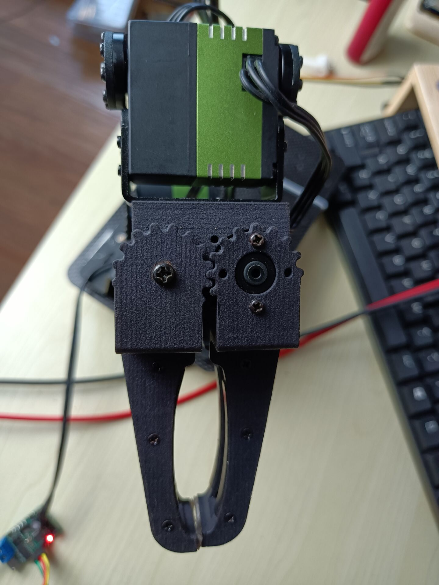
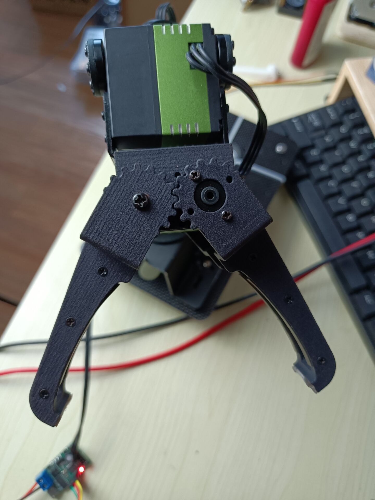
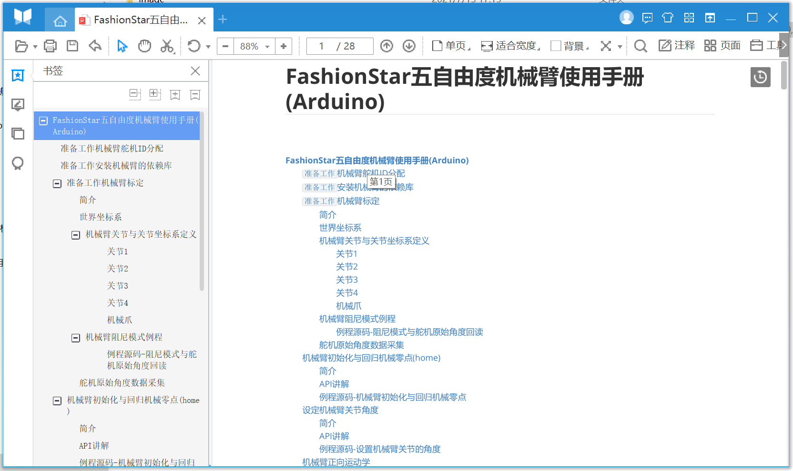

# 舵机与机械臂SDK使用教程

[toc]

Author: 阿凯爱玩机器人 & FashionStar


----


培训课程资料 - 百度网盘下载链接 (离线版PDF文件 + 开源代码 + 软件工具包)

链接：https://pan.baidu.com/s/1M5y_Qk6CvFyuNqi1fAERpg 
提取码：asvu 


## 课程实验配套物料

* Mega2560 R3开发板

* FashionStar串口总线舵机 

  RA8-U25

* UC-01舵机调试板

* 舵机线

* 电源 

* 机械臂U形支架


## 串行总线舵机

可以在FashionStar官方Wiki里面学习关于串行总线舵机的知识

[FashionStar在线产品使用手册 -Fashion Star Robot Wiki](https://wiki.fashionrobo.com/)





### UART串行总线舵机简介

为什么我们要用串口总线舵机，串口总线舵机相比较普通的PWM舵机有什么优势, 可以参考Wiki:  [UART串行总线舵机简介](https://wiki.fashionrobo.com/uartbasic/uart-servo-introduction/)


### 串口通信协议

舵机正反两面各有一个单总线串口接口， UART通信接收端（Rx）跟发送端（Tx）共用一根线，数据发送与接收分时复用（半双工）。


串行总线舵机通信协议如下: 

| 名称                  | 内容                                                         |
| --------------------- | ------------------------------------------------------------ |
| 电平标准              | TTL电平(TTL Level)                                           |
| 通信协议              | 单线半双工异步串行通信(Half duplex Asynchronous Serial Communication) |
| 波特率（Baudrate）    | 115200                                                       |
| 数据比特数(Data Bits) | 8                                                            |
| 校验方式(Parity)      | None 无校验                                                  |
| 停止位(Stop Bits)     | 1                                                            |

了解更多关于舵机自身的规格，结构参数等信息，可以参阅官方手册 [UART串行总线舵机的结构与参数](https://wiki.fashionrobo.com/uartbasic/uart-servo-structure/)


### 舵机转接板


舵机的通信接口是3pin的， 信号线只有一根。 但是单片机的串口通信是4pin的， 接收端跟发送端是分开的, 术语称之为双线全双工异步串行通信. 因此在单片机跟串口总线舵机之间， 需要一个**串行总线舵机转接板** 来负责串口通信信号的转换以及供电.


| 类目               | 内容         |
| :----------------- | :----------- |
| 生产商             | Fashion Star |
| 型号               | UC01-V1.0    |
| 输入电压范围       | 6-8.4 V      |
| USB接口型号        | micro USB    |
| USB转TLL芯片       | CH340        |
| 串行总线舵机接口数 | 2            |
| 舵机接口端子型号   | PH2.0 3Pin   |
| 舵机最大串联数     | 254          |

详细介绍， 参见[转接板UC01规格与接线说明](https://wiki.fashionrobo.com/uartbasic/uart-servo-adapter/)


需要做的事情: 

* 安装USB转TTL芯片 CH340的驱动
* 与舵机以及单片机之间的接线. 


使用电脑的USB接口连接串行总线舵机转接板, 可以直接通过电脑上的上位机程序控制舵机, 并修改舵机的配置参数.


> PS: 把上面的树莓派脑补为笔记本电脑. 


### 舵机上位机

通过电脑上的上位机程序控制舵机, 并修改舵机的配置参数. 详细教程: [UART串行总线舵机上位机软件使用说明](https://wiki.fashionrobo.com/uartbasic/uart-servo-software/)


* 下载上位机
* 配置串口
* 设置波特率为115200, 进行舵机检索. 


#### 设置舵机ID号

舵机出厂的时候， 默认ID号为0， 而在同一个串行总线上， 每个舵机都需要一个独立的ID号。 而且在机械臂的SDK里面， 要求ID号必须是从0开始连续的分配. 

需要使用上位机重新给舵机分配ID号, 且在分配ID号的时候, 每次总线上**只连接一个舵机**. 

参见: [UART串行总线舵机上位机软件使用说明](https://wiki.fashionrobo.com/uartbasic/uart-servo-software/)  > **9.修改舵机ID**







#### 舵机安装中位点

在进行机械臂安装的时候，需要用到上位机的舵机角度实时控制, 将舵机调整到中位点, 例如90°

将上位机切换到舵机角度控制模式上面, 调整舵机角度

参见: [UART串行总线舵机上位机软件使用说明](https://wiki.fashionrobo.com/uartbasic/uart-servo-software/)  > **12.角度控制模式**




### FashionStar串口总线舵机-开源软件生态

机器人开发学习的资源宝库:  [FashionStar Github开源项目首页  servodevelop](https://github.com/servodevelop)


#### PC

| 类型         | 仓库                                                         | 介绍                                | 适配平台       |
| ------------ | ------------------------------------------------------------ | ----------------------------------- | -------------- |
| 舵机SDK      | [fashionstar-uart-servo-python](https://github.com/servodevelop/fashionstar-uart-servo-python) | 串口总线舵机 Python3 SDK            | Windows, Linux |
| 舵机SDK      | [fashionstar-uart-servo-python2](https://github.com/servodevelop/fashionstar-uart-servo-python2) | 串口总线舵机 Python2 SDK            | Windows, Linux |
| 舵机SDK      | [fashionstar-uart-servo-cpp](https://github.com/servodevelop/fashionstar-uart-servo-cpp) | 串口总线舵机 C++ SDK                | Windows, Linux |
| 舵机SDK      | [fashionstar-uart-servo-ros1](https://github.com/servodevelop/fashionstar-uart-servo-ros1) | 串口总线舵机 ROS1 SDK(C++ & Python) | Linux          |
| 舵机应用案例 | [fashionstar-arm-4dof-python](https://github.com/servodevelop/fashionstar-arm-4dof-python) | 四自由度机械臂Python SDK            | Windows, Linux |
| 舵机应用案例 | [fashionstar-arm-5dof-python](https://github.com/servodevelop/fashionstar-arm-5dof-python) | 五自由度机械臂Python SDK            | Windows, Linux |
| 舵机应用案例 | [fashionstar-arm-4dof-opencv-python](https://github.com/servodevelop/fashionstar-arm-4dof-opencv-python) | 四自由度机械臂 OpenCV视觉抓取案例   |                |


#### Arduino

| 类型         | 仓库                                                         | 介绍                        | 适配平台               |
| ------------ | ------------------------------------------------------------ | --------------------------- | ---------------------- |
| 舵机SDK      | [fashionstar-uart-servo-arduino](https://github.com/servodevelop/fashionstar-uart-servo-arduino) | 串口总线舵机 Arduino SDK    | Uno,  Mega2560,  ESP32 |
| 舵机应用案例 | [fashionstar-gripper-arduino](https://github.com/servodevelop/fashionstar-gripper-arduino) | 自适应夹爪 Arduino SDK      | Uno,  Mega2560,  ESP32 |
| 舵机应用案例 | [fashionstar-arm-4dof-arduino](https://github.com/servodevelop/fashionstar-arm-4dof-arduino) | 四自由度机械手臂Arduino SDK | Uno                    |
| 舵机应用案例 | [fashionstar-arm-5dof-arduino](https://github.com/servodevelop/fashionstar-arm-5dof-arduino) | 五自由度机械手臂Arduino SDK | Uno,  Mega2560,  ESP32 |


#### STM32

| 类型         | 仓库                                                         | 介绍                                    | 适配平台           |
| ------------ | ------------------------------------------------------------ | --------------------------------------- | ------------------ |
| 舵机SDK      | [fashionstar-uart-servo-stm32f103](https://github.com/servodevelop/fashionstar-uart-servo-stm32f103) | 串口总线舵机STM32 SDK (STM32F103)       | STM32F103          |
| 舵机SDK      | [fashionstar-uart-servo-stm32f407](https://github.com/servodevelop/fashionstar-uart-servo-stm32f407) | 串口总线舵机STM32 SDK (STM32F407)       | STM32F407          |
| 舵机应用案例 | [fashionstar-gimbal-2dof-stm32f103-openmv](https://github.com/servodevelop/fashionstar-gimbal-2dof-stm32f103-openmv) | 二自由度云台 STM32 + OpenMV视觉追踪案例 | STM32F103 + OpenMV |
| 舵机应用案例 | [fashionstar-arm-4dof-stm32f103](https://github.com/servodevelop/fashionstar-arm-4dof-stm32f103) | 四自由度机械手臂 STM32 SDK              | STM32F103          |
| 舵机应用案例 | [fashionstar-arm-5dof-stm32f103](https://github.com/servodevelop/fashionstar-arm-5dof-stm32f103) | 五自由度机械手臂 STM32 SDK              | STM32F103          |


#### MicroPython 

| 类型    | 仓库                                                         | 介绍                         | 适配平台 |
| ------- | ------------------------------------------------------------ | ---------------------------- | -------- |
| 舵机SDK | [fashionstar-uart-servo-micropython-esp32](https://github.com/servodevelop/fashionstar-uart-servo-micropython-esp32) | 串口总线舵机 MicroPython SDK | ESP32    |


## Arduino Mega2560 开发板


预备工作

* 安装Arduino IDE

* 安装CH340驱动

  > Arduino Mega2560 与串行总线舵机转接板使用的是同一款USB转TTL芯片. 


Arduino Mega 2560开发板上一共有四个串口资源， 分别为Serial0, Serial1, Serial2, Serial3

分配如下: 

* **Serial3** 用作跟串口总线舵机进行通信,

* **Serial0** 用作日志输出(USB线所在的串口)。 


Arduino Mega2560跟串口转接板的接线方式如下: 

| Arduino Mega2560      | USB转TTL模块                |
| --------------------- | --------------------------- |
| D15(串口3 RX 接收端)  | Tx (USB转TTL模块的接收端)   |
| D14 (串口3 Tx 发送端) | Rx （USB转TTL模块的发送端） |
| GND                   | GND                         |



## 串口总线舵机(Arduino SDK)


串口总线舵机Arduino SDK, 代码仓库:   [fashionstar-uart-servo-arduino](https://github.com/servodevelop/fashionstar-uart-servo-arduino)

SDK适配了Arduino Mega2560开发板, 在doc文件夹下面, 直接打开PDF文件.  




需要掌握的知识点:

1. 舵机角度控制

   1. 简单角度控制
   2. 角度控制添加功率约束 - 实现自适应夹爪的功能, 选定一个合适的功率值
   3. 舵机自身的轨迹规划算法， 梯形轨迹规划基本概念, 学会使用SDK里面的角度控制高阶API。

2. 舵机角度查询

3. 阻尼模式

4. 同时控制多个舵机.

5. `作业`: 只使用舵机SDK给机械臂写一套动作组.


## 自适应夹爪(Arduino SDK)


自适应夹爪Arduino SDK 代码仓库  [fashionstar-gripper-arduino](https://github.com/servodevelop/fashionstar-gripper-arduino)

打开上位机, 使用角度控制模式, 分别获取爪子张开跟闭合的角度.

```cpp
// 爪子的配置
#define SERVO_ANGLE_GRIPPER_OPEN 15.0   // 爪子张开时的角度
#define SERVO_ANGLE_GRIPPER_CLOSE -45.0 // 爪子闭合时的角度
```








根据物体的重量以及舵机的型号, 选择一个合适的功率值

```cpp
#define GRIPPER_MAX_POWER 400           // 爪子的最大功率 单位mW
```


* 如果功率值设置的过高, 夹爪力度可能就过高, 等于普通的舵机角度控制模式. 
* 如果功率设置的过低, 会出现爪子卡顿, 没有力气, 停在特定位置, 不响应指令的情况.


## 五自由度机械臂(Arduino SDK)

五自由度机械臂Arduino SDK   [fashionstar-arm-5dof-arduino](https://github.com/servodevelop/fashionstar-arm-5dof-arduino)

SDK适配了Arduino Mega2560开发板, 在doc文件夹下面, 直接打开PDF文件. 




* 在运行其他例程前, 需要先完成 **机械臂舵机标定**. 
* 认识坐标系与关节的定义
* 例程学习

* `作业`  编写一个简单的物块抓取的实例


### 修改连杆长度


如果根据项目需要,  针对工作区的要求, 可能会调整机械臂连杆的尺寸, 则需要同步修改代码里面连杆的配置, 单位cm.

```cpp
#define FSARM_LINK2 8       // 连杆2的长度 单位cm
#define FSARM_LINK3 7.6     // 连杆3的长度 单位cm
#define FSARM_LINK4 13.6    // 连杆4的长度 单位cm(算上了爪子的长度)
```


