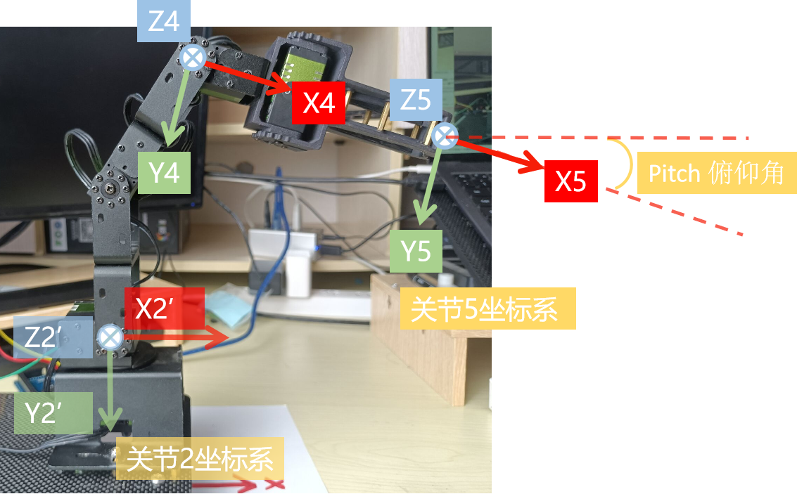

# 机械臂运动学推导


[toc]

Author: 阿凯爱玩机器人 & FashionStar


## 机械臂关节定义

### 机械臂基坐标系


### 关节编号


### 关节坐标系

#### 关节1坐标系


#### 关节2坐标系


#### 关节3坐标系


#### 关节4坐标系(腕关节)


#### 关节5坐标系(末端)




### 连杆长度


## 数学基础

### 余弦公式

在几何法逆向运动学的求解中, 一个比较重要的公式就是**余弦定理** , 已知三角形的三个边长, 让你求解出来每个夹角, 余弦公式如下: 


$$
cos(\theta) = \frac{a^2 + b^2 - c^2}{2*a*b}
$$

$$
\theta = arcos(\frac{a^2 + b^2 - c^2}{2*a*b})
$$


## 平面1自由度机械臂

最简单的情况， 是只有一个自由度, 即假设只有底部的舵机可以旋转。


### 正向运动学


$$
x_e = L_2*cos(\theta_1)
$$

$$
y_e = L_2*sin(\theta_1)
$$

### 逆向运动学

$$
\theta_1 = atan2(y_e, x_e)
$$


## 平面2自由度机械臂


如果去除了底部的关节1， 剩下的关节2, 关节3, 关节4就变成了平面的机械臂。 

从简单到复杂， 我们先来看平面二自由度机械臂的情况.


需要注意的是，根据右手螺旋法则可以知道 $\theta_2 < 0$, $\theta_3 > 0$


### 正向运动学


关节2的坐标值 
$$
x_2 = 0
$$

$$
y_2 = 0
$$

关节3的坐标值
$$
x_3 = x2 + L_2*cos(\theta_2) = L_2*cos(\theta_2)
$$

$$
y_3 = y_2 + L_2*sin(\theta_2) = L_2*sin(\theta_2)
$$

关节4的坐标值
$$
x_4 = x3 + L_3*cos(\theta_2+\theta_3) = L_2*cos(\theta_2) + L_3*cos(\theta_2+\theta_3)
$$

$$
y_4 = y_3 + L_3*sin(\theta_2+\theta_3) =  L_2*sin(\theta_2) + L_3*sin(\theta_2+\theta_3)
$$


### 逆向运动学

**求解$\theta_3$**


$\alpha$ 与$\theta_3$ 互补.
$$
\alpha = 180° - \theta_3
$$


使用余弦公式可得
$$
\begin{align}
cos(\theta_3) &= - cos(\alpha) \\
&= -\frac{L_2^2 + L_3^2 - (x_e^2 + y_e^2)}{2*L_2*L_3} \\
&= \frac{(x_e^2 + y_e^2) - L_2^2 - L_3^2}{2*L_2*L_3}
\end{align}
$$
为了方便求解，给$\theta_3$ 添加约束$0 < \theta_3 < 180°$


$$
sin(\theta_3) = \sqrt{1 - cos(\theta_3)^2}
$$

$$
\theta_3 = atan2(sin(\theta_3), cos(\theta_3))
$$


**求解$\theta_2$**


根据余弦定理可得


$$
cos(\phi) = \frac{L_2^2 + (x_e^2 + y_e^2) - L_3^2}{2*L_1*\sqrt{(x_e^2 + y_e^2)}}
$$
根据右手螺旋定则，可以知道$\phi$ 是小于0的，  $\phi \in [-180°, 0°]$ , 所以$sin(\phi) <= 0$
$$
sin(\phi) = -\sqrt{1 - cos(\phi)^2}
$$

$$
\phi = atan2(sin(\phi), cos(\phi))
$$
求解$\beta$ 
$$
\beta = atan2(y_e,  x_e)
$$

$$
\theta_2 = \phi + \beta = atan2(sin(\phi), cos(\phi)) + atan2(y_e,  x_e)
$$


> 注：Arduino机械臂逆向运动学求解，使用的是解析法求解的$\theta_2$ ，最后求得的结果一样. 


## 平面3自由度机械臂


### 正向运动学

继续前面平面二自由度公式推导
$$
\begin{align}
x_5 &= x_4 + L_4*cos(\theta_2 + \theta_3 + \theta_4) \\
&=  L_2*cos(\theta_2) + L_3*cos(\theta_2+\theta_3) +  L_4*cos(\theta_2 + \theta_3 + \theta_4)
\end{align}
$$

$$
\begin{align}
y_5 &= y_4 + L_4*sin(\theta_2 + \theta_3 + \theta_4) \\
&=  L_2*sin(\theta_2) + L_3*sin(\theta_2+\theta_3) +  L_4*sin(\theta_2 + \theta_3 + \theta_4)
\end{align}
$$

我们定义一个角度为俯仰角
$$
pitch = \theta_2 + \theta_3 + \theta_4
$$


### 逆向运动学

如果想求解平面三自由度机械臂的逆向运动学，除了指定末端的坐标$[x_e, y_e]$之外，还需要指定一个俯仰角$pitch$
$$
x_4 = x_e - L_4*cos(pitch)
$$

$$
y4 = y_e - L_4 * sin(pitch)
$$

于是，平面三自由度的逆向运动学求解问题， 就变成了平面二自由度机械臂逆向运动学的问题。 后续步骤同上.


## 空间四自由度机械臂


现在需要将底部的旋转关节考虑进入, 引入$\theta_1$. 


### 正向运动学

再上面**平面3自由度机械臂** 部分我们推导出来了$Joint_5$ 在坐标系$X_2'-Y_2'$ 坐标系下面的坐标。 

> 注: 左上角的标识，代表参考坐标系

$$
^{2'}x_5 = L_2*cos(\theta_2) + L_3*cos(\theta_2+\theta_3) +  L_4*cos(\theta_2 + \theta_3 + \theta_4)
$$

$$
^{2'}y_5 = L_2*sin(\theta_2) + L_3*sin(\theta_2+\theta_3) +  L_4*sin(\theta_2 + \theta_3 + \theta_4)
$$

接下来需要先将其转换到关节1坐标系下的坐标.
$$
^{1}x_5 = L_2*cos(\theta_2) + L_3*cos(\theta_2+\theta_3) +  L_4*cos(\theta_2 + \theta_3 + \theta_4)
$$

$$
^{1}y_5 = 0
$$

$$
^{1}z_5 = - L_2*sin(\theta_2) - L_3*sin(\theta_2+\theta_3) -  L_4*sin(\theta_2 + \theta_3 + \theta_4)
$$

然后再转换为机械臂基坐标系下的坐标， 引入关节1的旋转


$$
\begin{align*}
^{0}x_5 &= ^{1}x_5 * cos(\theta_1) \\
&= cos(\theta_1) * [ L_2*cos(\theta_2) + L_3*cos(\theta_2+\theta_3) +  L_4*cos(\theta_2 + \theta_3 + \theta_4)]
\end{align*}
$$

$$
\begin{align*}
^{0}y_5 &= ^{1}x_5 * sin(\theta_1) \\
&= sin(\theta_1) * [ L_2*cos(\theta_2) + L_3*cos(\theta_2+\theta_3) +  L_4*cos(\theta_2 + \theta_3 + \theta_4)]
\end{align*}
$$

$$
^{0}z_5 = - L_2*sin(\theta_2) - L_3*sin(\theta_2+\theta_3) -  L_4*sin(\theta_2 + \theta_3 + \theta_4)
$$


### 逆向运动学

逆向运动学，需要先将空间四自由度机械臂的问题，转换为平面三自由度机械臂的问题. 
$$
\theta_1 = atan2(y_e, x_e)
$$
计算末端坐标在关节1坐标系下的表示
$$
^1x_5= \sqrt{x_e^2 + y_e^2}
$$

$$
^1y_5 = 0
$$

$$
^1z_5 = z_e
$$

然后转换为关节2‘坐标系下的坐标
$$
^{2'}x_5 = ^1x_5
$$

$$
^{2'}y_5 = - ^1z_5
$$

然后再将俯仰角$pitch$ 一起带入**平面3自由度机械臂**  里面的逆向运动学求解过程.


## 机械臂运动学(Arduino)


### 正向运动学


```cpp
// 机械臂正向运动学
void FSARM_ARM5DoF::forwardKinematics(FSARM_JOINTS_STATE_T thetas, FSARM_POINT3D_T* toolPosi, float* pitch){
    FSARM_POINT3D_T wristPosi; //腕关节原点的坐标
    // 求解pitch
    *pitch = thetas.theta2 + thetas.theta3 + thetas.theta4;
    // 角度转弧度
    float theta1 = radians(thetas.theta1);
    float theta2 = radians(thetas.theta2);
    float theta3 = radians(thetas.theta3);
    float theta4 = radians(thetas.theta4);
    // 计算腕关节的坐标
    toolPosi->x = cos(theta1) * (FSARM_LINK2*cos(theta2)+FSARM_LINK3*cos(theta2+theta3) + FSARM_LINK4*cos(theta2+theta3+theta4));
    toolPosi->y = sin(theta1) * (FSARM_LINK2*cos(theta2)+FSARM_LINK3*cos(theta2+theta3) + FSARM_LINK4*cos(theta2+theta3+theta4));
    toolPosi->z = -FSARM_LINK2*sin(theta2)-FSARM_LINK3*sin(theta2+theta3)-FSARM_LINK4*sin(theta2+theta3+theta4);
}
```


### 逆向运动学


```cpp
// 机械臂逆向运动学
FSARM_STATUS FSARM_ARM5DoF::inverseKinematics(FSARM_POINT3D_T toolPosi, float pitch, FSARM_JOINTS_STATE_T* thetas){
    // 关节弧度
    float theta1 = 0.0;
    float theta2 = 0.0;
    float theta3 = 0.0;
    float theta4 = 0.0;
    FSARM_POINT3D_T wristPosi; // 腕关节坐标
    
    // 根据工具原点距离机械臂基坐标系的直线距离
    float disO2Tool = sqrt(pow(toolPosi.x,2) + pow(toolPosi.y, 2) + pow(toolPosi.z, 2));
    if (disO2Tool > (FSARM_LINK2+FSARM_LINK3+FSARM_LINK4)){
        return FSARM_STATUS_TOOLPOSI_TOO_FAR;
    }

    // 判断腕关节的原点是否在机械臂坐标系的Z轴上
    if (toolPosi.x == 0 && toolPosi.y == 0){
        // 让theta1保持跟原来相同
        theta1 = radians(this->servos[FSARM_JOINT1].queryRawAngle());
    }else{
        // 求解theta1
        theta1 = atan2(toolPosi.y, toolPosi.x);
        thetas->theta1 = degrees(theta1);
        // 判断theta1是否合法
        if (!servos[FSARM_JOINT1].isAngleLegal(thetas->theta1)){
            return FSARM_STATUS_JOINT1_OUTRANGE;
        }
    }

    // 俯仰角, 角度转弧度
    float pitch_rad = radians(pitch);
    // 计算腕关节的位置
    wristPosi.x = toolPosi.x - FSARM_LINK4*cos(pitch_rad)*cos(theta1);
    wristPosi.y = toolPosi.y - FSARM_LINK4*cos(pitch_rad)*sin(theta1);
    wristPosi.z = toolPosi.z + FSARM_LINK4*sin(pitch_rad);
    
    // 计算theta3
    float b;
    if(cos(theta1) !=0){
        b = wristPosi.x / cos(theta1);
    }else{
        b = wristPosi.y / sin(theta1);
    }
    float cos_theta3 = (pow(wristPosi.z, 2)+pow(b,2) - pow(FSARM_LINK2,2) - pow(FSARM_LINK3, 2))/(2*FSARM_LINK2*FSARM_LINK3);
    float sin_theta3 = sqrt(1 - pow(cos_theta3, 2));
    theta3 = atan2(sin_theta3, cos_theta3);
    thetas->theta3 = degrees(theta3);
    if(!servos[FSARM_JOINT3].isAngleLegal(thetas->theta3)){
        return FSARM_STATUS_JOINT3_OUTRANGE;
    }
    // 计算theta2
    float k1 = FSARM_LINK2 + FSARM_LINK3*cos(theta3);
    float k2 = FSARM_LINK3 * sin(theta3);
    float r = sqrt(pow(k1, 2) + pow(k2, 2));
    theta2 = atan2(-wristPosi.z/r, b/r) - atan2(k2/r, k1/r);
    thetas->theta2 = degrees(theta2);
    if(!servos[FSARM_JOINT2].isAngleLegal(thetas->theta2)){
        return FSARM_STATUS_JOINT2_OUTRANGE;
    }
    // 计算theta4
    theta4 = pitch_rad-(theta2 + theta3);
    thetas->theta4 = degrees(theta4);
    if(!servos[FSARM_JOINT4].isAngleLegal(thetas->theta4)){
        return FSARM_STATUS_JOINT4_OUTRANGE;
    }

    // 成功完成求解
    return FSARM_STATUS_SUCCESS;

}
```

