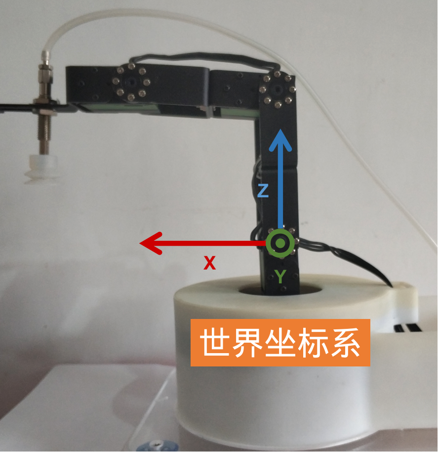
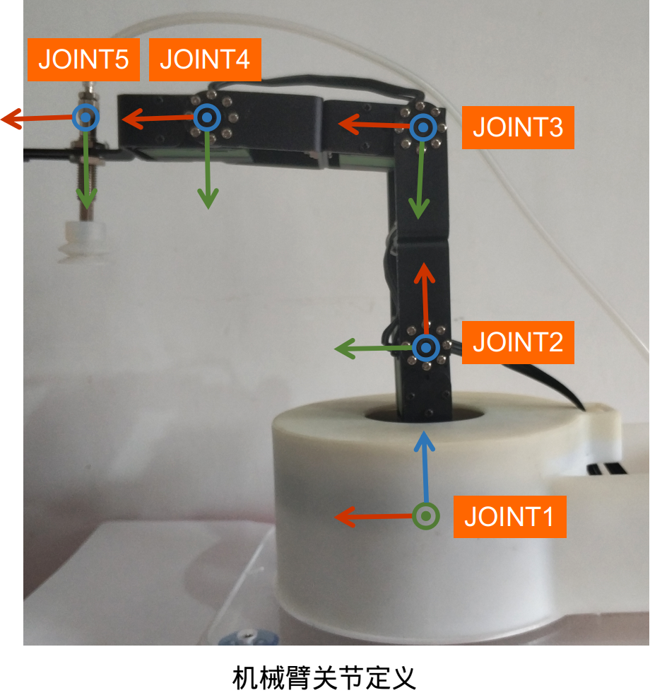
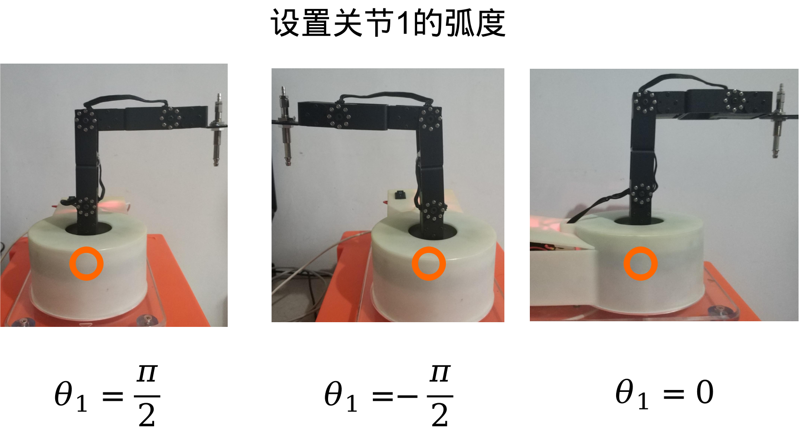

# FashionStar五自由度机械臂使用手册


[toc]

作者: 阿凯|Kyle

邮箱: xingshunkai@qq.com

更新时间: 2020/05/07


## 安装机械臂的Arduino库

将`FashionStar_Arm5DoF`这个工程文件, 整体拷贝到`Arduino IDE` 安装路径下的`libraries` 这个文件夹.


## Arduino Uno固件烧录的操作流程

1. 将Arduino UNO与PC相连

2. 断开Arduino UNO拓展版的外接电源的开关.

   开关拨至`OFF`

   

   

3. 在PC端打开Arduino IDE, 打开机械臂的例程文件.

   `Arduino IDE > Examples > FashionStar_ARM5DoF`

4. 编译并烧录固件至Arduino UNO

5. 打开Arduino UNO拓展板的外接电源的开关

   开关拨至`ON`

6. 按下Arduino UNO拓展版上的`RESET`按键. 

   **注: 一定要记得按下RESET键**


## 软串口日志输出

### 简介

因为Arduino Uno的硬件串口`Hardware Serial`会被串口舵机占用, 所以我们需要使用`Soft Serial` 来做日志输出.

### 操作流程

1. 安装USB转TTL模块的驱动程序.

2. 将Arduino跟USB转TTL模块通过杜邦线相连

   | Arduino UNO             | USB转TTL模块                |
   | ----------------------- | --------------------------- |
   | pin 6 (软串口RX 接收端) | Tx (USB转TTL模块的接收端)   |
   | pin7 (软串口Tx 发送端)  | Rx （USB转TTL模块的发送端） |
   | GND                     | GND                         |

   *实物图*

   

3. 将USB转TTL模块插入到电脑的USB口上

4. 打开串口调试助手, 选择USB转TTL模块的端口号, 配置如下

   

   点击`Open` ,  打开端口.

5. 打开`Arduino IDE > Examples > FashionStar_ARM4DoF >  software_serial` 

   将例程烧录到Arduino UNO 里面.

6. 查看运行效果 

   

### 例程源码

`software_serial.ino`

```cpp
/*
 * 测试软串口
 * 
 * <接线方式>
 * - Arduino Pin 6(软串口RX)  -> USB转TTL TX
 * - Arduino Pin 7(软串口TX)  -> USB转TTL RX
 * - Arduino GND              -> USB转TTL GND
 */
#include <SoftwareSerial.h>

// 软串口的配置
#define SOFT_SERIAL_RX 6
#define SOFT_SERIAL_TX 7
#define SOFT_SERIAL_BAUDRATE 4800
// 创建软串口
SoftwareSerial softSerial(SOFT_SERIAL_RX, SOFT_SERIAL_TX);

void setup(){
    
    softSerial.begin(SOFT_SERIAL_BAUDRATE); // 初始化软串口的波特率
}

void loop(){
    //发送一个数据
    softSerial.print("Hello World\n");
    delay(1000);
}
```


## 阻尼模式

### 简介

设置舵机为阻尼模式, 并不断的查询舵机的原始角度。用手掰舵机, 查看舵机原始角度的变化.


### 例程源码-阻尼模式与舵机原始角度回读

`arm_dammping_mode.ino`

```cpp
/* 
 * 机械臂阻尼模式与原始角度(Servo Raw Angles)回读
 * 同时也会打印机械臂关节角度(Arm Joint Angles)
 * --------------------------
 * 作者: 阿凯|Kyle
 * 邮箱: xingshunkai@qq.com
 * 更新时间: 2020/05/07
 */
#include <SoftwareSerial.h>
#include "FashionStar_Arm5DoF.h"

// 软串口的配置
#define SOFT_SERIAL_RX 6
#define SOFT_SERIAL_TX 7
#define SOFT_SERIAL_BAUDRATE 4800

SoftwareSerial softSerial(SOFT_SERIAL_RX, SOFT_SERIAL_TX); // 创建软串口
FSARM_ARM5DoF arm; //机械臂对象

void setup(){
    softSerial.begin(SOFT_SERIAL_BAUDRATE); // 初始化软串口的波特率
    arm.init(); //机械臂初始化
    arm.setDamping(); //设置舵机为阻尼模式
}

void loop(){
    FSARM_JOINTS_STATE_T thetas;
    arm.queryRawAngle(&thetas); //更新舵机角度
    //打印机械臂当前的舵机角度(原始)
    String message = "Servo Raw Angles: [ "+ String(thetas.theta1, 2)+\
         ", " + String(thetas.theta2, 2) + \
         ", " + String(thetas.theta3, 2) + \
         ", " + String(thetas.theta4, 2) + \
         ", " + String(thetas.gripper, 2) + " ]";

    softSerial.println(message);    
    delay(500);

    // 打印机械臂当前的关节角度
    arm.queryAngle(&thetas); //更新舵机角度
    message = "Arm Joint Angles: [ "+ String(thetas.theta1, 2)+\
         ", " + String(thetas.theta2, 2) + \
         ", " + String(thetas.theta3, 2) + \
         ", " + String(thetas.theta4, 2) + \
         ", " + String(thetas.gripper, 2) + " ]";
    
    softSerial.println(message);    
    delay(500);
}
```

**日志输出**

```
Servo Raw Angles: [ 44.32, 44.32, 44.32, 44.32, 44.32 ]
Arm Joint Angles: [ -42.86, -46.53, -1.65, -2.94, -1.29 ]
Servo Raw Angles: [ -1.65, -1.65, -1.65, -1.65, -1.65 ]
Arm Joint Angles: [ 4.33, -92.55, 45.26, -50.45, 43.57 ]
Servo Raw Angles: [ 45.26, 45.26, 45.26, 45.26, 45.26 ]
Arm Joint Angles: [ -43.83, -45.60, -2.61, -1.97, -2.21 ]
Servo Raw Angles: [ -2.61, -2.61, -2.61, -2.61, -2.61 ]
Arm Joint Angles: [ 5.31, -93.51, 46.23, -51.44, 44.50 ]
Servo Raw Angles: [ 46.23, 46.23, 46.23, 46.23, 46.23 ]
Arm Joint Angles: [ -44.83, -44.62, -3.60, -0.96, -3.16 ]
```


## 机械臂标定

### 简介

通过阻尼模式例程，采集特定关节在特定角度下的原始舵机角度, 并同步修改`FashionStar_Arm4DoF.h` 里面的相关配置.

### 机械臂舵机ID分配

机械臂舵机ID分配如下: 


补充: 爪子的ID号是4


### 世界坐标系

机械臂的世界坐标系/机械臂基坐标系定义如下:




世界坐标系的原点定义在#1号舵机的转轴中心处, 机械臂正前方为X轴, 上方为Z轴, Y轴指向纸面朝外.

### 机械臂关节与关节坐标系定义

关节与关节坐标系定义如下图所示:







爪子的角度定义:

爪子关节为0度的时候， 爪子闭合.


爪子关节为90度的时候,  爪子张开.


### 舵机原始角度数据采集

运行``arm_dammping_mode.ino`` 例程, 在阻尼模式下，将机械臂的关节掰到指定的位置, 并读取此时舵机的原始角度, 记录下来.

将采集的数据同步修改到`FashionStar_Arm5DoF.h`里面.

```cpp
// 舵机标定参数
#define FSARM_JOINT1_P90 -85.10  //关节1为90°时的舵机原始角度
#define FSARM_JOINT1_N90 90.23   //关节1为-90°时的舵机原始角度
#define FSARM_JOINT2_P0  90.80   //关节2为0°时的舵机原始角度
#define FSARM_JOINT2_N90 0.90    //关节2为-90°时的舵机原始角度
#define FSARM_JOINT3_P90 -45.5   //关节3为90°时的舵机原始角度
#define FSARM_JOINT3_N90 130.90  //关节3为-90°时的舵机原始角度
#define FSARM_JOINT4_P90 -93.4   //关节4为90°时的舵机原始角度
#define FSARM_JOINT4_N90 84.3    //关节4为-90°时的舵机原始角度
#define FSARM_GRIPPER_P0 -0.30   //爪子闭合的角度 关节角度为0
#define FSARM_GRIPPER_P90 93.80  //爪子完全张开的角度 关节角度为90度
```


## 机械臂初始化与回归机械零点(home)

### 简介

创建机械臂对象,机械臂硬件资源初始化， 并且让机械臂回归机械零点(Home).


### API讲解

导入机械臂的库文件

```cpp
#include "FashionStar_Arm5DoF.h"
```

创建一个机械臂对象

```cpp
FSARM_ARM5DoF arm; //机械臂对象
```

机械臂初始化:

* 硬件资源初始化: 串口, 舵机初始化.

* 载入舵机标定数据, 限定舵机角度范围

  设置舵机的平均转速.

```
arm.init(); //机械臂初始化
```

控制舵机归回到机械零点（Home）

```cpp
arm.home();
```


这个机械零点可以自定义, 如果要修改机械零点的位置需要修改`FashionStar_Arm5DoF.h`

```cpp
// HOME(机械零点的位置)
#define FSARM_HOME_X 13.5
#define FSARM_HOME_Y 0
#define FSARM_HOME_Z 6.4
#define FSARM_HOME_PITCH 20.0
```

### 例程源码-机械臂初始化与回归机械零点

```cpp
/*
 * 机械臂末端移动到Home的位置
 * --------------------------
 * 作者: 阿凯|Kyle
 * 邮箱: xingshunkai@qq.com
 * 更新时间: 2020/05/07
 */

#include "FashionStar_Arm5DoF.h"

FSARM_ARM5DoF arm; //机械臂对象


void setup(){
    arm.init(); //机械臂初始化
    arm.home();
}

void loop(){
    
}
```


## 设定机械臂关节角度

### 简介

控制机械臂的关节角度, 等待机械臂运动到特定的位置之后, 再执行后续的动作.

### API讲解

使用`setAngle()`函数控制舵机的角度.

`FashionStar_Arm5DoF.h` 里面定义了关节状态结构体`FSARM_JOINTS_STATE_T` .

```cpp
typedef struct{
    float theta1;
    float theta2;
    float theta3;
    float theta4;
    float gripper;
}FSARM_JOINTS_STATE_T;
```

创建一个关节状态结构体

```cpp
FSARM_JOINTS_STATE_T thetas; 
```

依次填写关节角度

```cpp
thetas.theta1 = 45.0;
thetas.theta2 = -130.0;
thetas.theta3 = 90.0;
thetas.theta4 = 60.0;
thetas.gripper = 45.0; // 爪子的
```

设置舵机旋转到特定的角度

```cpp
arm.setAngle(thetas);
```

使用`wait()`函数实现阻塞式等待,  不断查询舵机角度, 直到舵机旋转到目标角度

```cpp
arm.wait();            // 等待舵机旋转到目标位置
```


### 例程源码-设置机械臂关节的角度

```cpp
/*
 * 设置机械臂关节的角度
 * --------------------------
 * 作者: 阿凯|Kyle
 * 邮箱: xingshunkai@qq.com
 * 更新时间: 2020/05/07
 */
#include "FashionStar_Arm5DoF.h"

FSARM_ARM5DoF arm; //机械臂对象

void setup(){
    arm.init(); //机械臂初始化
}

void loop(){
    FSARM_JOINTS_STATE_T thetas; // 关节角度
    thetas.theta1 = 45.0;
    thetas.theta2 = -130.0;
    thetas.theta3 = 90.0;
    thetas.theta4 = 60.0;
    thetas.gripper = 45.0; // 爪子的角度

    // 设置
    arm.setAngle(thetas);  // 设置舵机旋转到特定的角度
    arm.wait();            // 等待舵机旋转到目标位置
    
    delay(1000); // 等待1s

    thetas.theta1 = 90.0;
    thetas.gripper = 0.0; // 爪子的角度
    arm.setAngle(thetas);  // 设置舵机旋转到特定的角度
    arm.wait();            // 等待舵机旋转到目标位置
    delay(1000);
}
```


## 机械臂正向运动学

### 简介

所谓正向运动学就是在已知关节角度的前提下, 计算机械臂末端在机械臂基坐标系下的位置/位姿.

### API讲解

`FashionStar_Arm4DoF.h` 里面定义了笛卡尔空间下点坐标的结构体`FSARM_POINT3D_T`

```cpp
// 笛卡尔空间下的点
typedef struct{
    float x;
    float y;
    float z;
}FSARM_POINT3D_T;
```


机械臂正向运动学函数原型

```cpp
FSARM_STATUS forwardKinematics(FSARM_JOINTS_STATE_T thetas, FSARM_POINT3D_T* toolPosi, float* pitch);
```

<输入参数 >

* `thetas` 关节状态结构体
* `toolPosi` 工具在世界坐标系下的位置 
* `pitch` 末端(爪子)的俯仰角

<输出参数>

无


演示样例:

```cpp
FSARM_JOINTS_STATE_T thetas; // 关节角度
thetas.theta1 = 45.0;
thetas.theta2 = -130.0;
thetas.theta3 = 90.0;
thetas.theta4 = 60.0;
thetas.gripper = 0.0; // 爪子闭合

FSARM_POINT3D_T toolPosi; // 末端的位置
float pitch;

arm.forwardKinematics(thetas, &toolPosi, &pitch); // 正向运动学
```


### 例程源码-机械臂正向运动学

```cpp
/*
 * 测试机械臂正向运动学
 * --------------------------
 * 作者: 阿凯|Kyle
 * 邮箱: xingshunkai@qq.com
 * 更新时间: 2020/04/23
 */
#include <SoftwareSerial.h>
#include "FashionStar_Arm5DoF.h"
// 软串口的配置
#define SOFT_SERIAL_RX 6
#define SOFT_SERIAL_TX 7
#define SOFT_SERIAL_BAUDRATE 4800

SoftwareSerial softSerial(SOFT_SERIAL_RX, SOFT_SERIAL_TX); // 创建软串口
FSARM_ARM5DoF arm; //机械臂对象

void testForwardKinematics(){
    FSARM_JOINTS_STATE_T thetas; // 关节角度
    thetas.theta1 = 45.0;
    thetas.theta2 = -130.0;
    thetas.theta3 = 90.0;
    thetas.theta4 = 60.0;
    thetas.gripper = 0.0; // 爪子闭合
    arm.setAngle(thetas);  // 设置舵机旋转到特定的角度
    arm.wait();            // 等待舵机旋转到目标位置
    
    FSARM_POINT3D_T toolPosi; // 末端的位置
    float pitch;
    arm.forwardKinematics(thetas, &toolPosi, &pitch); // 正向运动学
    // 打印正向运动学的结果
    softSerial.println("Tool Posi: X= " + String(toolPosi.x, 1) +\
         ", Y= " + String(toolPosi.y, 1) + \
         ", Z= " + String(toolPosi.z, 1));
    softSerial.println("Pitch: " + String(pitch, 2) + "deg");

}
void setup(){
    softSerial.begin(SOFT_SERIAL_BAUDRATE); // 初始化软串口
    arm.init(); //机械臂初始化
    softSerial.println("Test Forward Kinematics");
    testForwardKinematics();
}

void loop(){

}
```

*日志输出*

```
Test Forward Kinematics
Tool Posi: X= 9.5, Y= 9.5, Z= 6.4
Pitch: 20.00deg

```


### 例程源码-机械臂正向运动学+阻尼模式


```cpp
/*
 * 机械臂再阻尼模式下, 读取关节角度, 并打印末端的位姿
 * --------------------------
 * 作者: 阿凯|Kyle
 * 邮箱: xingshunkai@qq.com
 * 更新时间: 2020/05/07
 */
#include <SoftwareSerial.h>
#include "FashionStar_Arm5DoF.h"
// 软串口的配置
#define SOFT_SERIAL_RX 6
#define SOFT_SERIAL_TX 7
#define SOFT_SERIAL_BAUDRATE 4800

SoftwareSerial softSerial(SOFT_SERIAL_RX, SOFT_SERIAL_TX); // 创建软串口
FSARM_ARM5DoF arm; //机械臂对象

void testForwardKinematics(){
    FSARM_JOINTS_STATE_T thetas; // 关节角度
    arm.queryAngle(&thetas); // 查询舵机的角度
    
    FSARM_POINT3D_T toolPosi; // 末端的位置
    float pitch;
    arm.forwardKinematics(thetas, &toolPosi, &pitch); // 正向运动学
    // 打印正向运动学的结果
    softSerial.println("Tool Posi: X= " + String(toolPosi.x, 1) +\
         ", Y= " + String(toolPosi.y, 1) + \
         ", Z= " + String(toolPosi.z, 1) + \
         ", Pitch: " + String(pitch, 2) + "deg" + \
         ", Gripper= " + String(thetas.gripper, 1));

}

void setup(){
    softSerial.begin(SOFT_SERIAL_BAUDRATE); // 初始化软串口
    arm.init(); //机械臂初始化
    arm.setDamping(); //设置舵机为阻尼模式
    softSerial.println("Test Forward Kinematics");
}

void loop(){
    testForwardKinematics();
    delay(1000);
}
```


**输出日志**

```
Tool Posi: X= 18.0, Y= -0.4, Z= 8.6, Pitch: 21.36deg, Gripper= 0.8
Tool Posi: X= 18.1, Y= -0.7, Z= 7.9, Pitch: 21.96deg, Gripper= 1.0
Tool Posi: X= 17.5, Y= 8.9, Z= 12.8, Pitch: 4.73deg, Gripper= 1.0
Tool Posi: X= 19.0, Y= 6.1, Z= 10.6, Pitch: 11.49deg, Gripper= 33.6
Tool Posi: X= 17.4, Y= 6.2, Z= 13.5, Pitch: 2.62deg, Gripper= 33.4
Tool Posi: X= 17.8, Y= 7.8, Z= 13.1, Pitch: 3.36deg, Gripper= 46.6
Tool Posi: X= 20.7, Y= 2.7, Z= 6.6, Pitch: 23.02deg, Gripper= 47.0
```


## 机械臂逆向运动学

### 简介

机械臂逆向运动学是指,给定工具在世界坐标系下的位姿, 求解此时关节的角度.


### API讲解

机械臂逆向运动学的函数原型:

```cpp
FSARM_STATUS inverseKinematics(FSARM_POINT3D_T toolPosi, float pitch, FSARM_JOINTS_STATE_T* thetas)
```

**<输入参数>**

* `toolPosi`: 工具坐标
* `pitch`: 末端俯仰角
* `thetas`: 关节状态

**<输出参数>**

* `FSARM_STATUS` 状态码

  通过状态码可以知道逆向运动学求解是否成功,  如果失败则可以查看到底是哪个关节超出范围.

  状态码的定义如下:

  ```cpp
  // 状态码
  #define FSARM_STATUS uint8_t
  #define FSARM_STATUS_SUCCESS 0 // 成功
  #define FSARM_STATUS_FAIL 1 // 失败
  #define FSARM_STATUS_JOINT1_OUTRANGE 2 // 关节1超出范围
  #define FSARM_STATUS_JOINT2_OUTRANGE 3 // 关节2超出范围
  #define FSARM_STATUS_JOINT3_OUTRANGE 4 // 关节3超出范围
  #define FSARM_STATUS_JOINT4_OUTRANGE 5 // 关节4超出范围
  #define FSARM_STATUS_TOOLPOSI_TOO_FAR 6 // 工具坐标目标点距离机械臂太遥远
  ```

  

演示示例:

```cpp
FSARM_POINT3D_T toolPosi; // 末端位置
float pitch = 20.0; // 俯仰角
FSARM_JOINTS_STATE_T thetas; // 关节角度-逆向运动学输出的结果
// 设置末端的坐标
toolPosi.x = 9.5;
toolPosi.y = 9.5;
toolPosi.z = 6.4;
// 机械臂逆向运动学
FSARM_STATUS code = arm.inverseKinematics(toolPosi, pitch, &thetas);
```


### 例程源码-机械臂逆向运动学 

```cpp
/*
 * 测试机械臂逆向运动学
 * --------------------------
 * 作者: 阿凯|Kyle
 * 邮箱: xingshunkai@qq.com
 * 更新时间: 2020/05/07
 */

#include <SoftwareSerial.h>
#include "FashionStar_Arm5DoF.h"
// 软串口的配置
#define SOFT_SERIAL_RX 6
#define SOFT_SERIAL_TX 7
#define SOFT_SERIAL_BAUDRATE 4800
// 创建软串口
SoftwareSerial softSerial(SOFT_SERIAL_RX, SOFT_SERIAL_TX);
FSARM_ARM5DoF arm; //机械臂对象

void setup(){
    softSerial.begin(SOFT_SERIAL_BAUDRATE);
    arm.init(); //机械臂初始化

    // 测试正向运动学
    softSerial.println("Test Forward Kinematics");
    FSARM_JOINTS_STATE_T thetas; // 关节角度
    FSARM_POINT3D_T toolPosi; // 末端位置
    float pitch; // 末端的俯仰角 (deg)
    
    thetas.theta1 = 45.0;
    thetas.theta2 = -130.0;
    thetas.theta3 = 90.0;
    thetas.theta4 = 60.0;
    thetas.gripper = 0.0;
    arm.setAngle(thetas);  // 机械臂运动到目标角度
    arm.wait();

    // 测试逆向运动学
    // 用正向运动学的结果验证逆向运动学的结果
    arm.forwardKinematics(thetas, &toolPosi, &pitch); // 正向运动学
    // 打印正向运动学的结果
    softSerial.println("Tool Posi: X= " + String(toolPosi.x, 1) +\
         ", Y= " + String(toolPosi.y, 1) + \
         ", Z= " + String(toolPosi.z, 1));

    // 逆向运动学
    softSerial.println("Test Inverse Kinematics");
    FSARM_JOINTS_STATE_T thetas_ret; // 关节角度-逆向运动学输出的结果

    softSerial.println("Pitch = "+String(pitch, 2) + " deg");
    FSARM_STATUS code = arm.inverseKinematics(toolPosi, pitch, &thetas_ret);
    softSerial.println("code = "+String(code, DEC));
    softSerial.println("thetas = [" + String(thetas_ret.theta1, 2) + ", "\
        + String(thetas_ret.theta2, 2) + ", "\
        + String(thetas_ret.theta3, 2) + ", "\
        + String(thetas_ret.theta4, 2) + "]");
    
}

void loop(){

}
```

**输出日志**

```
Test Forward Kinematics
Tool Posi: X= 9.5, Y= 9.5, Z= 6.4
Test Inverse Kinematics
Pitch = 20.00 deg
code = 0
thetas = [45.00, -130.00, 90.00, 60.00]

```


## 机械臂末端控制(move)

### 简介

控制机械臂的末端移动到特定的位置.


### API讲解

移动末端函数`move`的函数原型:

```cpp
FSARM_STATUS move(float tx, float ty, float tz, float pitch, bool isWait);
```

**<输入参数>**

* `tx`: 末端工具坐标 x
* `ty`: 末端工具坐标 y
* `tz`: 末端工具坐标 z
* `pitch`末端俯仰角
* `isWait`: 是否是阻塞式等待

**<输出参数>**

* `FSARM_STATUS`: 状态码, 与机械臂逆向运动学求解里面的定义相同.


使用示例:

```cpp
// 机械臂末端移动到 x1=13.5, y1=0, z1=5， pitch=25° 
// 并且阻塞式等待, 直到机械臂运动到目标角度, 才结束该语句
arm.move(13.5, 0, 5, 25.0, true);
```

等同于

```cpp
arm.move(13.5, 0, 5, 25.0);
arm.wait();
```


### 例程源码-机械臂末端控制

`arm_move.ino`

```cpp
/*
 * 测试机械臂点控, 从一个点运动到另外一个点
 * --------------------------
 * 作者: 阿凯|Kyle
 * 邮箱: xingshunkai@qq.com
 * 更新时间: 2020/05/07
 */
#include "FashionStar_Arm5DoF.h"

FSARM_ARM5DoF arm; //机械臂对象

void setup(){
    arm.init(); //机械臂初始化
}

void loop(){
    // 机械臂末端移动到 x1=13.5, y1=0, z1=5 pitch=25°
    // 并且阻塞式等待, 直到机械臂运动到目标角度, 才结束该语句
    arm.move(13.5, 0, 5, 25.0, true);
    delay(1000); // 停顿1s
    
    arm.move(14.0, 0, -4.0, 55.0, true);
    delay(1000); // 停顿1s

    arm.move(9.5, 9.5, -4.0, 55.0, true);
    delay(1000); // 停顿1s
}
```


### 例程源码-物块搬运

```cpp
/*
 * 机械臂物块抓取
 * 将物块从一个位置移动到另外一个位置
 * --------------------------
 * 作者: 阿凯|Kyle
 * 邮箱: xingshunkai@qq.com
 * 更新时间: 2020/05/07
 */
#include "FashionStar_Arm5DoF.h"

#define GRIPPER_OPEN 20.0  // 爪子张开的角度
#define GRIPPER_CLOSE 11.5 // 爪子闭合

FSARM_ARM5DoF arm; //机械臂对象

// 爪子张开
void gripperOpen(){
    arm.setAngle(FSARM_GRIPPER, GRIPPER_OPEN); // 设置爪子的角度,爪子张开
    arm.wait();
}

// 爪子闭合
void gripperClose(){
    arm.setAngle(FSARM_GRIPPER, GRIPPER_CLOSE); // 设置爪子的角度,爪子张开
    arm.wait();
}

// 运行动作组
void run_action_group(){
    // 复位
    arm.move(13.5, 0, 5, 25.0, true);
    // 抬起物块
    gripperOpen();
    arm.move(14.0, 0, -4.0, 55.0, true);
    arm.move(15.6, 0, -7.8, 66.0, true);
    gripperClose();
    arm.move(14.0, 0, -4.0, 55.0, true);
    // 放下物块
    arm.move(15.4, -10.0, -4.0, 55.0, true);
    arm.move(15.4, -10.0, -7.8, 66.0, true);
    gripperOpen();
    arm.move(15.4, -10.0, -4.0, 55.0, true);
    // 复位
    arm.move(13.5, 0, 5, 25.0, true);
}

void setup(){
    arm.init(); //机械臂初始化
    arm.home(); // 机械臂回归到Home的位置
}

void loop(){
    // 运行动作组
    run_action_group();
    // 停顿5s
    delay(5000);
}
```


